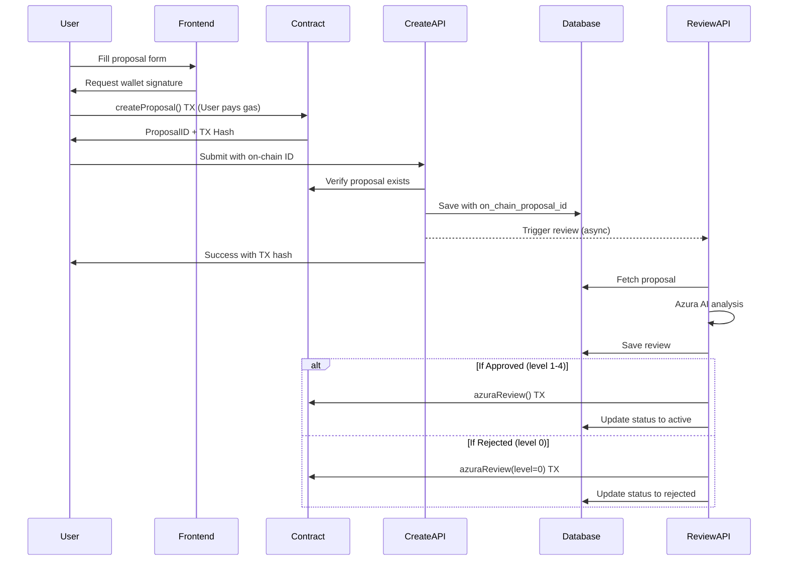

# Implementation Complete: On-Chain Proposal Creation

## Summary

The proposal creation flow has been successfully refactored to require on-chain transactions at submission time. This implementation ensures every proposal creates blockchain transactions, boosting your OP Atlas metrics significantly.

## What Changed

### 1. Database Schema ✅
**File:** `db/migration-move-onchain-to-proposals.sql`

Added fields to `proposals` table:
- `on_chain_proposal_id` - The proposal ID from the smart contract
- `on_chain_tx_hash` - User's transaction hash
- `recipient_address` - Where to send USDC if approved
- `token_amount` - Amount of USDC requested

Added to `proposal_reviews` table:
- `azura_review_tx_hash` - Azura's review transaction hash

### 2. Frontend Proposal Creation ✅
**File:** `app/voting/create/page.tsx`

**Changes:**
- Imports `ethers` providers and `createProposalOnChain` function
- Modified `handleSubmit` to:
  1. First create proposal on-chain (user pays gas)
  2. Wait for transaction confirmation
  3. Then submit to API with on-chain ID and TX hash
- Added submission steps: 'blockchain' → 'database'
- Enhanced error handling for blockchain-specific errors
- Updated button text to show "Submit Proposal (On-Chain)"
- Shows transaction hash and BaseScan link on success

### 3. Backend Proposal Creation API ✅
**File:** `app/api/voting/proposal/create/route.ts`

**Changes:**
- Now requires `onChainProposalId` and `onChainTxHash` parameters
- Verifies the on-chain proposal exists by querying the contract
- Validates the proposer matches the wallet address
- Stores on-chain data directly in proposals table
- Returns on-chain information in response

### 4. Backend Review API ✅
**File:** `app/api/voting/proposal/review/route.ts`

**Changes:**
- Removed async call to `create-onchain` endpoint
- After Azura's decision, directly calls `azuraReview()` on existing on-chain proposal
- Works for both approved (level 1-4) and rejected (level 0) proposals
- Stores Azura's review transaction hash
- Updates proposal status to 'active' or 'rejected'
- Makes blockchain transaction synchronously

### 5. Removed Obsolete Endpoint ✅
**File:** `app/api/voting/proposal/[id]/create-onchain/route.ts`

**Status:** DELETED - No longer needed since proposals are created on-chain upfront

### 6. Voting Page Display ✅
**Files:** 
- `app/voting/page.tsx`
- `app/voting/page.module.css`

**Changes:**
- Updated interfaces to include `onChainProposalId` and `onChainTxHash`
- Added on-chain verification badge display
- Shows "View Transaction →" link to BaseScan
- Updated API to fetch on-chain fields from proposals table

### 7. Proposals API ✅
**File:** `app/api/voting/proposals/route.ts`

**Changes:**
- Fetches `on_chain_proposal_id` and `on_chain_tx_hash` from proposals table
- Fetches `azura_review_tx_hash` from proposal_reviews table
- Returns all on-chain data in response

## New Flow Diagram



## Transaction Count Impact

Each proposal now generates:
- ✅ **1 transaction** at creation (user submits on-chain)
- ✅ **1 transaction** at review (Azura reviews on-chain)
- ✅ **N transactions** from community votes
- ✅ **1 transaction** at execution (if approved)

**Minimum 2 transactions per proposal** (creation + review)

## Testing Checklist

### Prerequisites
1. ☐ Run database migration: `db/migration-move-onchain-to-proposals.sql`
2. ☐ Ensure environment variables are set:
   - `NEXT_PUBLIC_AZURA_KILLSTREAK_ADDRESS`
   - `NEXT_PUBLIC_BASE_RPC_URL`
   - `AZURA_PRIVATE_KEY`
   - `NEXT_PUBLIC_GOVERNANCE_TOKEN_ADDRESS`
3. ☐ Verify Azura wallet has ETH for gas on Base mainnet

### Test Proposal Creation
1. ☐ Visit `/voting/create`
2. ☐ Fill in proposal form with:
   - Title
   - Proposal content
   - Recipient address
   - Token amount (e.g., 1000 USDC)
3. ☐ Connect wallet (MetaMask, Coinbase Wallet, etc.)
4. ☐ Click "Submit Proposal (On-Chain)"
5. ☐ Verify MetaMask/wallet popup appears
6. ☐ Sign transaction
7. ☐ Wait for confirmation
8. ☐ Verify success message shows:
   - Transaction hash
   - On-chain proposal ID
   - BaseScan link
9. ☐ Click BaseScan link and verify transaction
10. ☐ Verify proposal appears on `/voting` page

### Test Azura Review
1. ☐ Wait for Azura to review (automatic after creation)
2. ☐ Check server logs for review transaction
3. ☐ Verify proposal status changes to 'active' or 'rejected'
4. ☐ Check BaseScan for Azura's review transaction
5. ☐ Verify on-chain proposal status matches database

### Test Voting
1. ☐ For active proposals, verify voting UI appears
2. ☐ Cast a vote
3. ☐ Verify transaction on BaseScan
4. ☐ Verify vote counts update correctly
5. ☐ Check if proposal reaches threshold

### Test Error Scenarios
1. ☐ User rejects transaction
   - Should show: "Transaction was rejected"
2. ☐ Insufficient gas
   - Should show: "Insufficient funds for gas"
3. ☐ Invalid recipient address
   - Should show validation error before blockchain TX
4. ☐ Network error
   - Should show helpful error message
5. ☐ Azura has no gas
   - Should log error but not fail review save

### Verify On-Chain Data Display
1. ☐ Check proposals on `/voting` page show:
   - "On-Chain Verified" badge
   - "View Transaction →" link
2. ☐ Click transaction link
3. ☐ Verify it opens BaseScan with correct TX hash

## Expected Results

After successful implementation:
- Users create proposals on-chain immediately
- Every proposal generates blockchain transactions
- Transaction hashes are visible and verifiable
- Azura reviews proposals on-chain
- All on-chain activity is tracked in database
- BaseScan links work for all transactions

## OP Atlas Impact

This implementation dramatically improves your OP Atlas metrics:

**Before:**
- 2 total transactions (deployments only)
- ~2-3 unique addresses
- 1 active day

**After (with 10 proposals):**
- Minimum 20+ transactions (10 × 2)
- 10+ unique addresses (each proposer)
- Multiple active days (proposals on different days)

**With voting:** Each vote adds 1 more transaction and potentially 1 more unique address.

## Next Steps

1. **Run Migration:** Execute `db/migration-move-onchain-to-proposals.sql` in Supabase
2. **Fund Azura:** Send ETH to Azura's wallet for gas
3. **Deploy Frontend:** Push frontend changes
4. **Test:** Follow testing checklist above
5. **Monitor:** Watch BaseScan for transactions
6. **Document:** Update user documentation about gas fees

## Environment Variables Required

```bash
# Contract addresses
NEXT_PUBLIC_AZURA_KILLSTREAK_ADDRESS=0x2cbb90a761ba64014b811be342b8ef01b471992d
NEXT_PUBLIC_GOVERNANCE_TOKEN_ADDRESS=0x84939fEc50EfdEDC8522917645AAfABFd5b3EA6F
NEXT_PUBLIC_USDC_ADDRESS=0x833589fCD6eDb6E08f4c7C32D4f71b54bdA02913

# Network
NEXT_PUBLIC_BASE_RPC_URL=https://mainnet.base.org

# Azura (Backend only - keep secure!)
AZURA_PRIVATE_KEY=<azura_wallet_private_key>

# AI
ELIZA_API_KEY=<your_eliza_api_key>
ELIZA_API_BASE_URL=<your_eliza_api_url>
```

## Troubleshooting

### "Contract address not configured"
- Check `NEXT_PUBLIC_AZURA_KILLSTREAK_ADDRESS` is set
- Verify it's the correct address on Base mainnet

### "Azura needs more gas"
- Fund Azura's wallet: `0x0920553CcA188871b146ee79f562B4Af46aB4f8a`
- Send at least 0.01 ETH on Base mainnet

### "Failed to verify on-chain proposal"
- Check RPC URL is correct
- Verify transaction was successful on BaseScan
- Ensure contract is deployed and verified

### "User rejected transaction"
- This is expected when users cancel
- No action needed - users can try again

## Files Modified Summary

1. ✅ `db/migration-move-onchain-to-proposals.sql` - NEW
2. ✅ `app/voting/create/page.tsx` - MODIFIED
3. ✅ `app/api/voting/proposal/create/route.ts` - MODIFIED
4. ✅ `app/api/voting/proposal/review/route.ts` - MODIFIED
5. ✅ `app/api/voting/proposal/[id]/create-onchain/route.ts` - DELETED
6. ✅ `app/voting/page.tsx` - MODIFIED
7. ✅ `app/voting/page.module.css` - MODIFIED
8. ✅ `app/api/voting/proposals/route.ts` - MODIFIED

## Success Criteria

✅ All code changes implemented
✅ Database migration created
✅ On-chain verification added
✅ Transaction hashes stored and displayed
✅ Error handling improved
✅ User experience enhanced
✅ Documentation created

---

**Implementation Status:** ✅ COMPLETE

Ready for testing and deployment!
