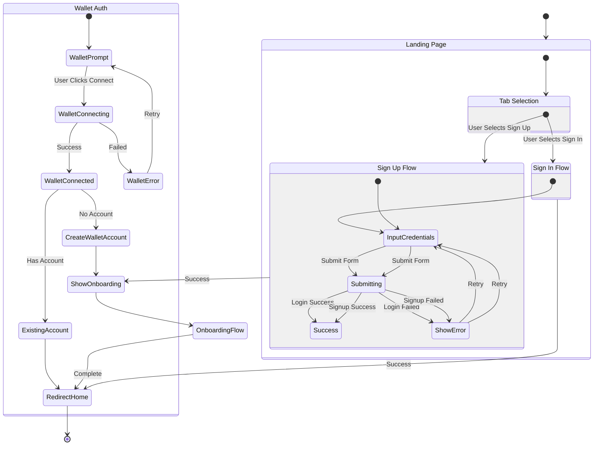
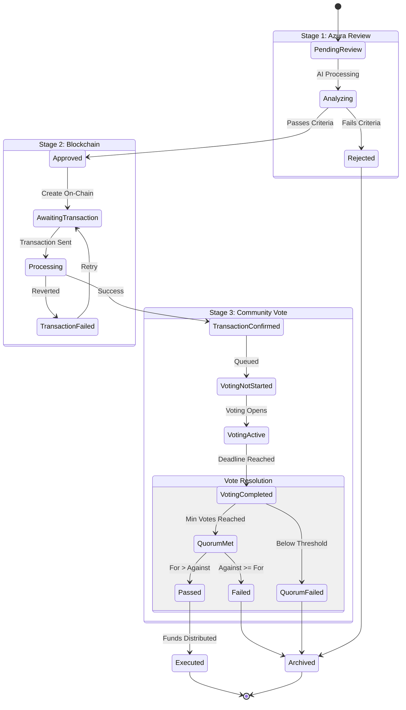
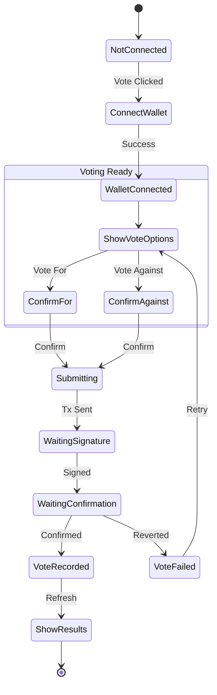
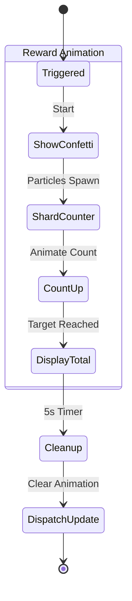
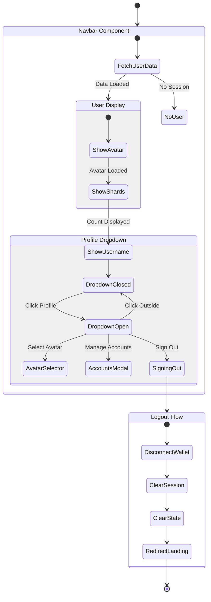

# Mental Wealth Academy - Component State Machine Diagram

This document describes the state machines for the major components and user flows in the application.

## Table of Contents
1. [Application-Level State Machine](#application-level-state-machine)
2. [Authentication Flow](#authentication-flow)
3. [Onboarding Flow](#onboarding-flow)
4. [Proposal/Voting System](#proposalvoting-system)
5. [Quest System](#quest-system)
6. [Ideas/Learning Flow](#ideaslearning-flow)

---

## Application-Level State Machine


```mermaid
stateDiagram-v2
    [*] --> Landing

    state "Unauthenticated" as unauth {
        Landing --> SignIn: Email/Password
        Landing --> WalletConnect: Connect Ethereum
        SignIn --> Landing: Failed
        WalletConnect --> Landing: Cancelled
    }

    state "Authentication" as auth {
        SignIn --> CheckProfile: Success
        WalletConnect --> WalletSignup: Connected
        WalletSignup --> CheckProfile: Account Created
    }

    state "Onboarding" as onboard {
        CheckProfile --> OnboardingModal: Profile Incomplete
        OnboardingModal --> AvatarSelection: Profile Saved
        AvatarSelection --> Home: Avatar Selected
        CheckProfile --> AvatarSelection: No Avatar
        CheckProfile --> Home: Profile Complete
    }

    state "Authenticated App" as app {
        Home --> Quests
        Home --> Ideas
        Home --> Voting
        Home --> Library
        Home --> Forum
        Quests --> Home
        Ideas --> Home
        Voting --> Home
        Library --> Home
        Forum --> Home
    }

    state "Session Management" as session {
        app --> Landing: Sign Out
        app --> Landing: Session Expired
    }
```

---

## Authentication Flow



---

## Onboarding Flow

```mermaid
stateDiagram-v2
    [*] --> AccountStep
    
    state "Account Step" as AccountStep {
        [*] --> ShowForm
        ShowForm --> ValidatingEmail: Email Input (non-wallet)
        ShowForm --> ValidatingUsername: Username Input
        ShowForm --> ValidatingBirthday: Birthday Input
        ShowForm --> ValidatingPassword: Password Input (non-wallet)
        
        ValidatingEmail --> EmailValid: Valid Format
        ValidatingEmail --> EmailInvalid: Invalid
        EmailInvalid --> ShowForm: Fix
        
        ValidatingUsername --> CheckingAvailability: 5+ chars
        CheckingAvailability --> UsernameAvailable: Available
        CheckingAvailability --> UsernameTaken: Taken
        UsernameTaken --> ShowForm: Choose Different
        
        ValidatingBirthday --> AgeValid: 18+ years
        ValidatingBirthday --> AgeInvalid: Under 18
        AgeInvalid --> ShowForm: Error Shown
        
        ValidatingPassword --> PasswordValid: 8+ chars
        ValidatingPassword --> PasswordInvalid: Too Short
        PasswordInvalid --> ShowForm: Fix
    }
    
    state "Form Ready" as FormReady {
        EmailValid --> FormReady
        UsernameAvailable --> FormReady
        AgeValid --> FormReady
        PasswordValid --> FormReady
    }
    
    FormReady --> CreatingAccount: Continue Button
    
    state "Creating Account" as CreatingAccount {
        [*] --> SignupAPI: Email Signup
        [*] --> ProfileAPI: Wallet Signup
        SignupAPI --> ProfileAPI: Account Created
        ProfileAPI --> Success: Profile Saved
        ProfileAPI --> Error: Failed
        Error --> ShowForm: Retry
    }
    
    Success --> DispatchProfileUpdated
    DispatchProfileUpdated --> CloseModal
    CloseModal --> [*]
```

---

## Proposal/Voting System

### Proposal Stages State Machine



### Vote Button States



---

## Quest System

```mermaid
stateDiagram-v2
    [*] --> QuestList
    
    state "Quest List View" as QuestList {
        [*] --> ShowActiveQuests
        ShowActiveQuests --> SelectQuest: Click Quest Card
    }
    
    SelectQuest --> QuestSidebar
    
    state "Quest Detail Sidebar" as QuestSidebar {
        [*] --> ShowQuestDetails
        ShowQuestDetails --> CheckQuestType
    }
    
    state "Quest Types" as CheckQuestType {
        CheckQuestType --> TwitterFollowQuest: twitter-follow
        CheckQuestType --> ManualQuest: manual
        CheckQuestType --> AutomaticQuest: automatic
    }
    
    state "Twitter Follow Quest" as TwitterFollowQuest {
        [*] --> CheckXConnection
        CheckXConnection --> PromptConnect: Not Connected
        CheckXConnection --> CheckFollow: Connected
        PromptConnect --> XAuthFlow: Connect X
        XAuthFlow --> CheckFollow: Success
        CheckFollow --> NotFollowing: Follow Check
        CheckFollow --> AlreadyFollowing: Already Follows
        NotFollowing --> FollowPrompt: Show Button
        FollowPrompt --> VerifyFollow: User Follows
        VerifyFollow --> QuestComplete: Confirmed
        AlreadyFollowing --> QuestComplete
    }
    
    state "Quest Completion" as QuestComplete {
        [*] --> AwardShards
        AwardShards --> ShowAnimation: Shards Added
        ShowAnimation --> UpdateNavbar: Animation Done
        UpdateNavbar --> CloseSidebar
    }
    
    CloseSidebar --> QuestList
```

### Shard Animation Flow



---

## Navigation State Machine



---

## Component Event Communication

```mermaid
stateDiagram-v2
    direction LR
    
    state "Window Events" as Events {
        profileUpdated: profileUpdated
        shardsUpdated: shardsUpdated
        xAccountUpdated: xAccountUpdated
        userLoggedIn: userLoggedIn
    }
    
    state "Event Producers" as Producers {
        OnboardingModal --> profileUpdated: Profile Created
        AvatarSelection --> profileUpdated: Avatar Changed
        QuestComplete --> shardsUpdated: Shards Awarded
        XAuthCallback --> xAccountUpdated: X Connected
        LoginSuccess --> userLoggedIn: User Authenticated
    }
    
    state "Event Consumers" as Consumers {
        profileUpdated --> Navbar: Refresh User Data
        profileUpdated --> HomePage: Check Avatar
        shardsUpdated --> Navbar: Update Count
        xAccountUpdated --> QuestSidebar: Refresh Status
        userLoggedIn --> WalletHandler: Update State
    }
```

---

## Summary

The Mental Wealth Academy application consists of several interconnected state machines:

| Component | States | Key Transitions |
|-----------|--------|-----------------|
| **Authentication** | 3 | Landing → Sign In/Sign Up → Onboarding → Home |
| **Onboarding** | 3 | Account → Profile → Avatar |
| **Proposal Stages** | 9 | Review → Blockchain → Vote → Execute |
| **Quest System** | 5 | List → Detail → Action → Complete → Reward |
| **Ideas Feed** | 4 | Load → Display → Swipe → Complete |

### Key Design Patterns

1. **Session-Based Auth**: Uses HTTP-only cookies with optional wallet integration
2. **Event-Driven Updates**: Components communicate via window events (`profileUpdated`, `shardsUpdated`)
3. **Optimistic UI**: States update immediately with async confirmation
4. **Progressive Disclosure**: Complex flows broken into discrete steps (onboarding, voting)
5. **AI Co-Pilot**: Azura daemon participates in proposal review
6. **Simplified Auth Flow**: Separate Sign In and Sign Up tabs with clear user intent - no waterfall pattern
